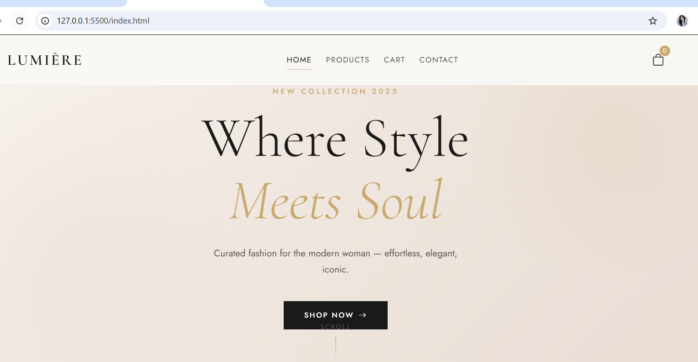
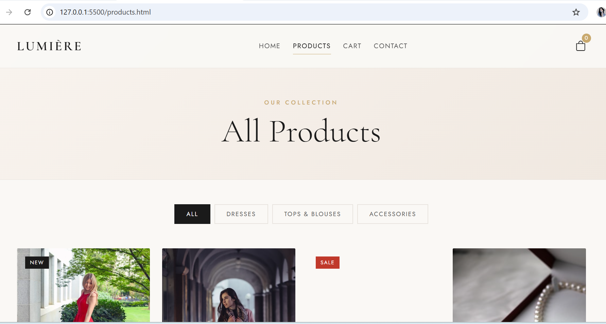
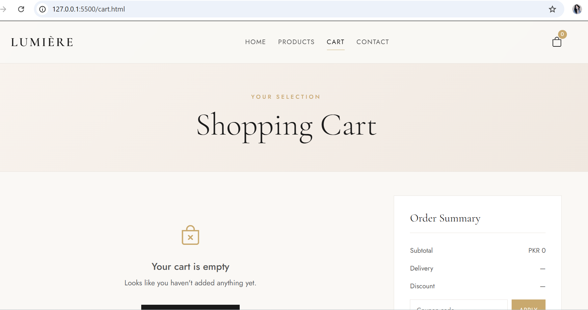
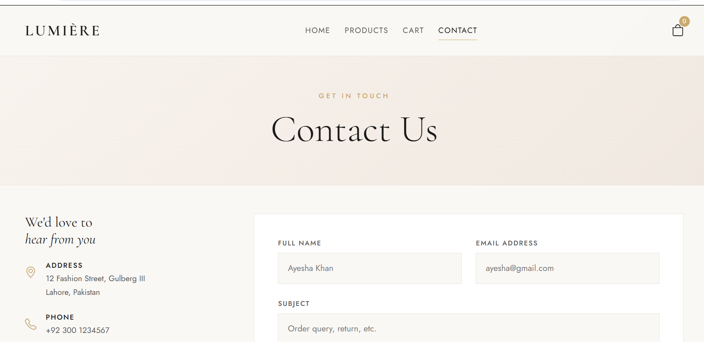

# LUMIÈRE — Fashion Store Website 🛍️

A responsive multi-page fashion e-commerce website built with **HTML, CSS, Bootstrap 5, and JavaScript**.

---

## 🖥️ Live Preview

> Open `index.html` in your browser to view the project.

---

## ✨ Features

- 🏠 **Home Page** — Hero section, category cards, featured products, promo banner, footer
- 🛍️ **Products Page** — Product grid with **category filter** (All / Dresses / Tops / Accessories)
- 🛒 **Cart Page** — Add/remove items, quantity controls, coupon code, order summary
- 📬 **Contact Page** — Contact form with validation, info section
- 🔔 **Add to Cart Toast** — Live notification on product add
- 💾 **LocalStorage Cart** — Cart persists across pages
- 📱 **Fully Responsive** — Mobile, tablet & desktop
- 🎨 **Elegant Light Theme** — Cream/gold color palette with Cormorant Garamond typography

---

## 🛠️ Technologies Used

| Technology | Purpose |
|---|---|
| HTML5 | Page structure & semantics |
| CSS3 | Custom styling, animations, CSS variables |
| Bootstrap 5 | Responsive grid, navbar, modal |
| JavaScript (Vanilla) | Cart logic, filter, form validation |
| Bootstrap Icons | UI icons |
| Google Fonts | Cormorant Garamond + Jost |

---

## 📁 Project Structure

```
FashionStore/
│
├── index.html        # Home page
├── products.html     # Products listing with filter
├── cart.html         # Shopping cart
├── contact.html      # Contact form
├── style.css         # All custom styles
└── script.js         # All JavaScript logic
```

---

## 🚀 How to Run

1. Clone the repository:
```bash
git clone https://github.com/YourUsername/fashion-store.git
```
2. Open `index.html` in any browser — no build step needed!

---

## 📸 Screenshots

### Home Page


### Products Page


### Cart Page


### Contact Page


---

## 🎯 Key Concepts Demonstrated

- Bootstrap 5 **grid system** for responsive layouts
- CSS **custom properties** (variables) for consistent theming
- **LocalStorage** for cart persistence across pages
- JavaScript **DOM manipulation** and event handling
- **Form validation** without any library
- CSS **animations** and hover transitions
- Clean **BEM-style** CSS organization

---

## 👩‍💻 Author

**Anita** — BSCS Final Year Student  
📍 Pakistan  
🔗 [GitHub Profile](https://github.com/anitaxhub)

---

## 📄 License

This project is open source and available under the [MIT License](LICENSE).
